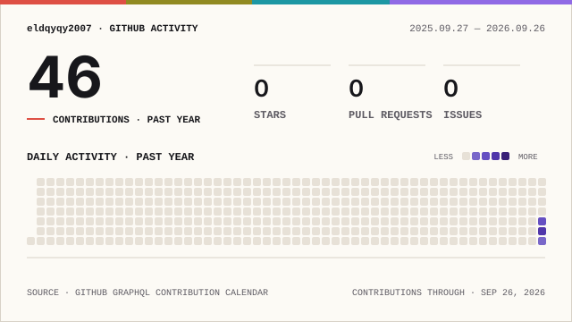
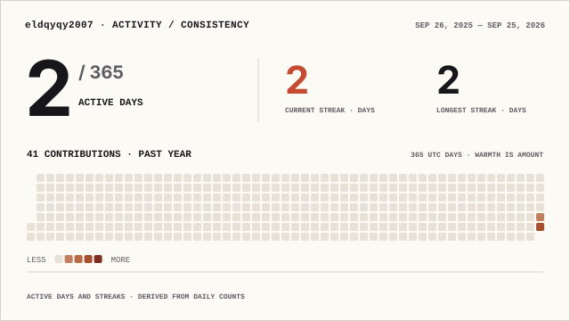
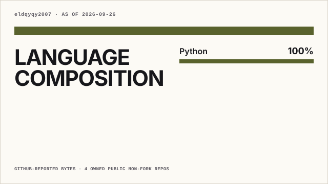

# 🛡️ Mohammed Eldqyqy

### Offensive Security | Penetration Testing | Red Teaming

**Bug Hunter • Penetration Tester • Cybersecurity Engineer • Red Teamer**

Web Application Security • API Security • Mobile Security • Active Directory • Network Security • AI/LLM Security

---

## 👋 About Me

I'm Mohammed Eldqyqy, an offensive-security focused learner building practical skills in penetration testing, bug hunting, red teaming, and security research.

My current focus is on **Web, API, Mobile, Active Directory, Network, and AI/LLM security** while continuously improving my programming, operating-system, networking, and exploitation skills.

> My GitHub is being transitioned toward cybersecurity. Some older repositories are not security-related and were created before my current offensive-security focus.

---

## 🎯 Offensive Security Focus

| Domain | Focus |
|---|---|
| 🌐 Web Security | Web application pentesting, vulnerability research, bug bounty |
| 🔌 API Security | REST/GraphQL API testing, authentication and authorization |
| 📱 Mobile Security | Android application security, dynamic/static analysis |
| 🏢 Active Directory | Windows/AD enumeration, attacks, privilege escalation |
| 🌐 Network Security | Network enumeration, service exploitation, traffic analysis |
| 🔴 Red Teaming | Adversary simulation, C2, Windows tradecraft |
| 🤖 AI/LLM Security | Prompt injection, LLM application testing, AI red teaming |
| 🔬 Research | Reverse engineering, exploit development, security tooling |

---

## 💻 Languages & Technologies

---

## 🧰 Security Tooling

### 🌐 Web & API
Burp Suite • OWASP ZAP • Nuclei • ffuf • Gobuster • SQLMap • Postman

### 🔎 Recon & Network
Nmap • Masscan • Amass • Subfinder • httpx • Wireshark • Netcat

### 🏢 Active Directory & Windows
BloodHound • Impacket • NetExec • Rubeus • Mimikatz • Responder

### 🔴 Red Team & Exploitation
Metasploit • Sliver • Cobalt Strike • PowerShell • Empire

### 🔬 Reverse Engineering
Ghidra • IDA • x64dbg • WinDbg • PE-bear

### 📱 Mobile Security
MobSF • Frida • Objection • ADB • JADX

### 🤖 AI / LLM Security
LLM application testing • Prompt injection testing • AI red teaming • API security testing

---

## 📚 Training & Learning

> **Training / learning completed or studied — not presented as certifications unless officially earned.**

- **Security+** — CompTIA curriculum
- **Network+** — CompTIA curriculum
- **eJPTv2** — Hossam Shady / RedNexus Academy
- **Red Teaming Diploma** — Hossam Shady / RedNexus Academy
- **Advanced Bug Bounty Secrets** — Hossam Shady / RedNexus Academy
- **OSCP Training** — Hossam Shady / RedNexus Academy
- **AI Red Teaming** — Hossam Shady / RedNexus Academy

---

## 🧪 Labs & Practice

Currently building practical experience through:

- Web & API security labs
- Mobile security labs
- Active Directory environments
- Network penetration testing
- Red-team tradecraft
- AI/LLM security testing
- Security automation with Python and Bash

---

## 🚀 Projects

I'm gradually building a cybersecurity-focused portfolio around practical tools, automation, research, and write-ups.

Planned areas include:

- 🔎 Recon & enumeration tooling
- 🌐 Web pentesting utilities
- 🔌 API security tooling
- 🏢 Active Directory tooling
- 🌐 Network pentesting utilities
- 📱 Mobile security tooling
- 🤖 AI/LLM security tooling
- 📝 Security research & write-ups

---

## 📊 GitHub Analytics

<picture>
  <source media="(prefers-color-scheme: dark)" srcset="./profile/signal-field-wide-dark.svg">
  
</picture>

---

## 🏆 GitHub Highlights

---

## 🔥 Contribution Activity & Streak

 

<picture>
  <source media="(prefers-color-scheme: dark)" srcset="./profile/activity-consistency-wide-dark.svg">
  
</picture>

---

## 🧠 Language Composition

<picture>
  <source media="(prefers-color-scheme: dark)" srcset="./profile/language-composition-wide-dark.svg">
  
</picture>

---

## 📫 Connect With Me

---

**Offensive Security • Research • Build • Learn**

